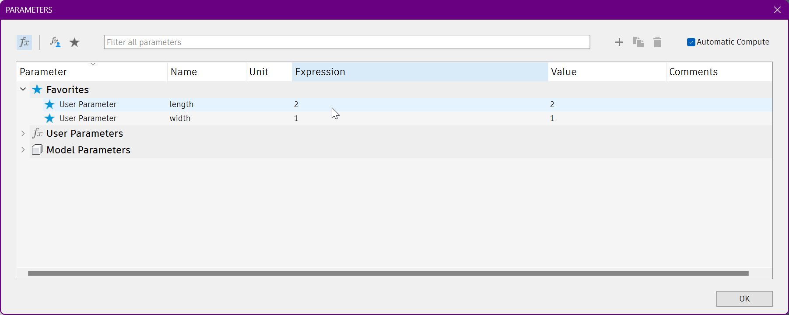

### Brought to you by Matthew Peng, Kaihon Hui, and Marc Chalouhi of the Design & Fabrication class of 23-24.

---

# Info
The Box Template model can be opened in Fusion 360.
The dimensions can easily be changed in the model parameters.

The boxes we printed were done with AA04 print heads.
We found that the tolerances weren't as nice when using AA08.

---

For cutting the tray with the laser cutter, take larger boards and then cut them small enough so that four can fit in the large cutter at once.
Placing them next to each other when cutting allows for all the holes to be cut in a single job and ensures that they are properly aligned.
(Though if you *can* find a large enough single board, that'll work as well.)

We adhered our boards together with thermoplastic cement which'll be, uh, somewhere in the Fabrication shed.
You'll find it eventually. I hope.
